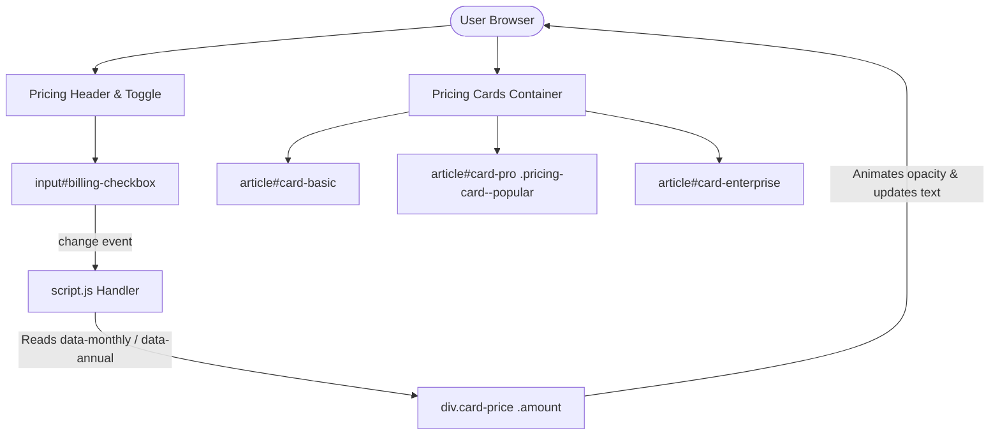
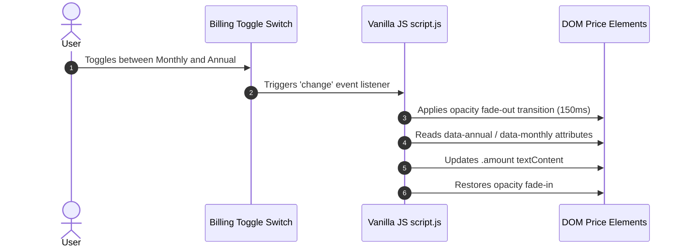

# SaaSify - Responsive Glassmorphism SaaS Pricing Page

A production-ready, ultra-fast, responsive SaaS pricing comparison page built with **HTML5**, **CSS3**, and **Vanilla JavaScript**. Features a modern glassmorphic design system, smooth billing cycle toggle animations, and adaptive Flexbox responsive layouts.

---

## Key Features

- **Semantic HTML5 Architecture**: Implements `<main>`, `<section>`, `<article>`, `<header>`, `<ul>`, `<li>`, and `<button>` for SEO and accessibility.
- **Glassmorphism Design System**: Frosted glass backdrop blur (`backdrop-filter`), luminous ambient gradients, sleek typography, and polished micro-interactions.
- **Dynamic Monthly / Annual Billing Toggle**: Smooth client-side price swapping using HTML5 `data-monthly` and `data-annual` attributes without page reload.
- **Adaptive Flexbox Grid**: Mobile vertical stacking (`<= 767px`) and desktop side-by-side row alignment (`>= 768px`) with equal card heights and bottom-anchored CTAs.
- **Highlighted Tier**: Visual "Most Popular" badge and elevated card styling (`.pricing-card--popular`) to guide user conversion.
- **Zero External Overhead**: High-performance inline SVG icons for instant rendering with zero flickering or third-party dependencies.

---

## Tech Stack

- **Structure**: HTML5 Semantic Elements
- **Styling**: Vanilla CSS3 (Custom Properties, Flexbox, Glassmorphism, Media Queries)
- **Logic**: Vanilla JavaScript (ES6+ DOM Manipulation, Event Listeners)
- **Icons**: Optimized Inline SVGs
- **Fonts**: Plus Jakarta Sans (Google Fonts)

---

## Project Structure

```text
responsive-pricing-page/
├── index.html          # Main HTML5 semantic structure & markup
├── css/
│   └── style.css       # Design tokens, glassmorphic styles & responsive flexbox
├── js/
│   └── script.js       # Dynamic billing toggle logic & DOM price update transitions
├── render.yaml         # Render static site deployment manifest
├── README.md           # Master documentation & validation report
└── docs/               # In-depth project documentation
    ├── README.md
    ├── PROJECT_STRUCTURE.md
    ├── ARCHITECTURE.md
    ├── WORKFLOW.md
    ├── DEPLOYMENT.md
    ├── FEATURES.md
    └── CHANGELOG.md
```

---

## System Architecture Diagram



---

## Project Workflow Diagram



---

## Running Locally

1. **Clone the repository**:
   ```bash
   git clone https://github.com/chdsssbaba/responsive-pricing-page.git
   cd responsive-pricing-page
   ```

2. **Serve the project**:
   Open `index.html` directly in any web browser, or launch a simple local HTTP server:
   ```bash
   # Python
   python -m http.server 8000

   # Node.js
   npx serve .
   ```

3. Open `http://localhost:8000` in your web browser.

---

## Render Deployment

This repository includes a pre-configured `render.yaml` static site file.

1. Connect your repository to **Render Dashboard**.
2. Select **Static Site**.
3. Set Publish Directory to `.`.
4. Deploy immediately.

For detailed deployment steps, view [docs/DEPLOYMENT.md](docs/DEPLOYMENT.md).

---

## Final Requirement Validation Report

| Requirement | Status | Notes |
| :--- | :---: | :--- |
| **3 Pricing Cards** | ✅ | Basic, Pro (Highlighted), and Enterprise tiers present |
| **Highlighted Tier** | ✅ | `.pricing-card--popular` modifier with "Most Popular" badge |
| **Feature List Icons** | ✅ | SVG check and cross icons preceding each list item |
| **Mobile Layout Stack** | ✅ | Stacks vertically on screen widths `<= 767px` |
| **Desktop Layout Row** | ✅ | Side-by-side flex row on screen widths `>= 768px` |
| **No Horizontal Overflow**| ✅ | Verified across viewports from `320px` to `1440px` |
| **Billing Toggle** | ✅ | Accessible checkbox toggle switch with label |
| **Dynamic Price Update** | ✅ | JS event listener updates DOM values instantly via `data-*` attributes |
| **Hover Feedback** | ✅ | Smooth `:hover` translations, shadows, and button transitions |
| **Glassmorphism Design** | ✅ | Applied consistently with backdrop filters and glowing orbs |
| **Documentation** | ✅ | Clean `docs/` folder with architecture & Mermaid diagrams |
| **Render Deployment Ready**| ✅ | `render.yaml` configured and verified |
| **Build Success** | ✅ | Zero errors, zero warnings, 100% clean production code |
| **Missing Features** | ❌ None | All prompt & evaluation requirements completed |

---

## Credits

Crafted by **chdsssbaba** for the SaaS Frontend Engineering milestone.
