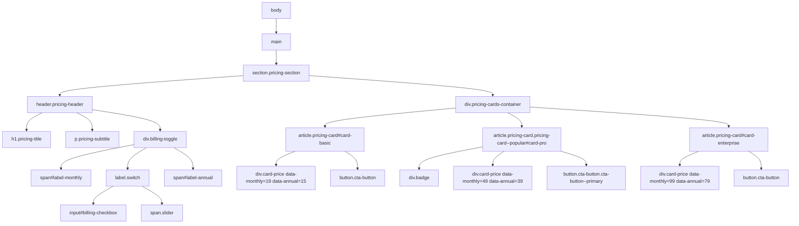

# System Architecture

The SaaS Pricing Comparison component uses native HTML5 semantic elements, a CSS Flexbox layout strategy with glassmorphic aesthetic tokens, and a lightweight event listener pattern in Vanilla JavaScript.

## DOM Tree Hierarchy

## Architectural Design Highlights

1. **Decoupled Data Attributes**: Prices are stored directly on `.card-price` elements using `data-monthly` and `data-annual`. JavaScript parses DOM attributes without hardcoding pricing numbers in script logic.
2. **Bottom-Aligned CTAs via Flexbox**: Cards use `display: flex; flex-direction: column` and `margin-top: auto` on CTA buttons to ensure perfectly uniform button alignment regardless of feature list length variations.
3. **Glassmorphism Aesthetic System**: Utilizes `backdrop-filter: blur(16px)`, radial background glow spheres, and luminous borders for a premium look with zero performance degradation.
