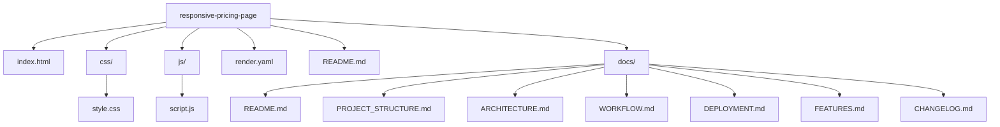

# Project Structure

Overview of the folder and file organization of the SaaS Pricing Page application.

## Directory Tree

```text
responsive-pricing-page/
├── index.html          # Main HTML5 document with semantic markup
├── css/
│   └── style.css       # Design tokens, glassmorphism UI & Flexbox layout
├── js/
│   └── script.js       # Vanilla JS DOM price toggle implementation
├── render.yaml         # Render static web service configuration
├── README.md           # Master project overview & requirement validation
└── docs/               # Technical documentation
    ├── README.md
    ├── PROJECT_STRUCTURE.md
    ├── ARCHITECTURE.md
    ├── WORKFLOW.md
    ├── DEPLOYMENT.md
    ├── FEATURES.md
    └── CHANGELOG.md
```

## Structure Mermaid Diagram


