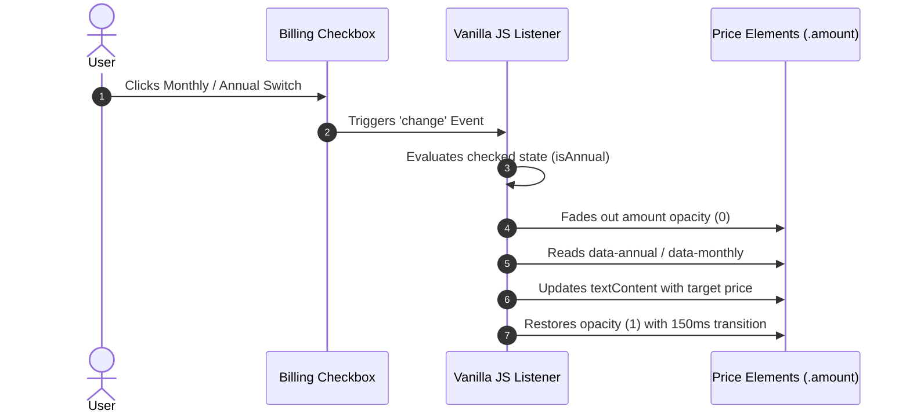

# Project Workflow

This document details the user interactive sequence and technical workflow during runtime interaction.

## Interactive Billing Cycle Sequence

## Responsive Layout Adaptability

1. **Mobile Viewport (<= 767px)**: Parent container `.pricing-cards-container` applies `flex-direction: column`. Cards stack vertically with `align-items: center` to prevent overflow.
2. **Tablet & Desktop Viewport (>= 768px)**: Parent container switches to `flex-direction: row` with `align-items: stretch` so all three cards match height automatically.
